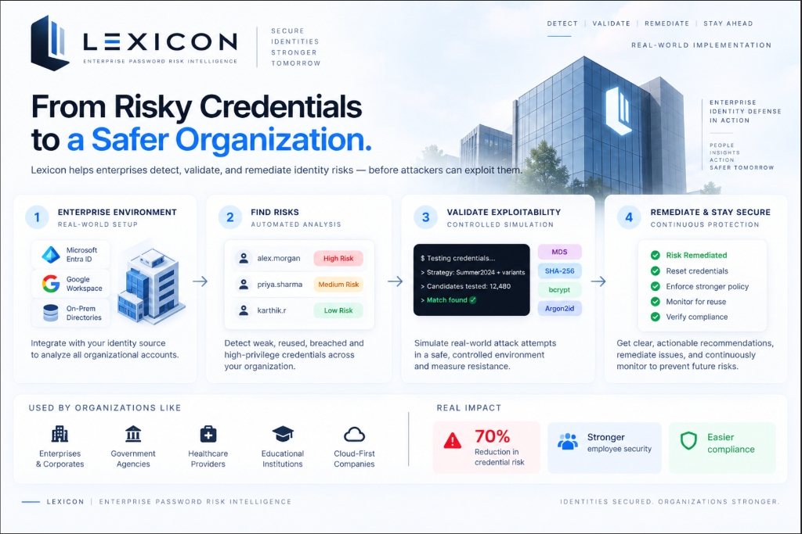

# Lexicon — Enterprise Password Risk Intelligence Platform

[](https://nextjs.org/)
[](https://fastapi.tiangolo.com/)
[](https://github.com/Daninet/hash-wasm)
[](https://www.python.org/)
[](https://www.typescriptlang.org/)
[](#security--compliance-standards)

**Lexicon** is an enterprise-grade Identity & Access Risk Intelligence platform engineered to evaluate organizational credential risk across large-scale Active Directory and corporate identity environments. Rather than evaluating isolated password strings in a vacuum, **Lexicon** correlates organizational hierarchy, multi-account password reuse families, administrative privileges, real-world breach telemetry, and empirical client-side exploitability into an actionable defense cockpit.

> *"Don't just determine whether a password is weak. Determine which identities create the greatest organizational blast radius, demonstrate controlled exploitability through bounded simulation, compare cryptographic hashing resistance, and deliver actionable CISO remediation roadmaps."*

---

<p align="center">
  
</p>

---

## 🏛️ High-Level System Architecture

```text
                                         LEXICON PLATFORM
                                                │
                ┌───────────────────────────────┴───────────────────────────────┐
                ▼                                                               ▼
       BACKEND TELEMETRY API (FastAPI)                              FRONTEND DEFENSE COCKPIT (Next.js 15)
                │                                                               │
  ┌─────────────┴─────────────┐                                   ┌─────────────┴─────────────┐
  │ Enterprise Directory Core │                                   │ Multi-Role Portals:       │
  │ Deterministic Risk Engine │ ── [REST /api/dataset/*] ───────► │  • Public Product Landing │
  │ Breach Corpus & HIBP API  │ ── [REST /api/remediation/*] ───► │  • Employee Shield Portal │
  │ AI Remediation Advisory   │ ◄─ [POST /api/attack/result] ──── │  • SOC Defense Operations │
  └───────────────────────────┘                                   └─────────────┬─────────────┘
                                                                                │
                                                                  ┌─────────────┴─────────────┐
                                                                  │ Client-Side Web Workers   │
                                                                  │  • attackWorker (WASM)    │
                                                                  │  • hashWorker (hash-wasm) │
                                                                  │  • k-Anonymity HIBP Probe │
                                                                  └───────────────────────────┘
```

---

## ⚡ Core Capabilities & Technical Innovations

### 1. Enterprise-Scale Identity Audit & Lateral Blast Radius
* **Organizational Directory Analysis:** Correlates credential strength across diverse enterprise departments (IT, Engineering, Finance, Operations, Legal, Executive Leadership).
* **Credential Reuse Family Detection:** Traditional hash-equality auditing fails on salted algorithms (`bcrypt`, `Argon2id`). Lexicon analyzes credential group topology to identify multi-department reuse clusters, exposing how single low-privilege compromises propagate laterally to Domain Admins.
* **Hero Account Threat Vector:** Traces high-risk targets such as Enterprise Active Directory Admins sharing credentials across dozens of standard accounts.

### 2. Two-Stage Explainable Risk Scoring Engine
Separates static enterprise directory posture from active empirical attack evidence:

* **Stage 1 — Baseline Risk Score (Enterprise-Wide):**
  $$\text{Baseline Risk} = 0.30 \times (1 - \text{entropy}_{\text{norm}}) + 0.25 \times \text{BreachMatch} + 0.20 \times \text{ReuseCluster}_{\text{norm}} + 0.15 \times \text{PrivilegeWeight} + 0.10 \times \text{PolicyViolations}$$
  * Categorizes accounts into **Critical ($\ge 0.75$)**, **High ($\ge 0.50$)**, **Medium ($\ge 0.25$)**, and **Low ($< 0.25$)** tiers.

* **Stage 2 — Empirical Attack Adjustment:**
  $$\text{Attack Adjustment} = +0.15 \text{ (if cracked within budget)} + \text{ConfidenceBonus}(\text{speed, candidates, algo})$$
  $$\text{Final Risk Score} = \text{Baseline Risk} + \text{Attack Adjustment}$$
  * *Integrity Rule:* Attack adjustments are applied exclusively after an account is actively tested in the Attack Lab.

### 3. Client-Side Bounded Attack Simulation Lab
* **Zero Data Exfiltration:** The mutation engine and candidate stream execute exclusively inside client browser Web Workers via WebAssembly (`hash-wasm`). Plaintext credential candidates are never transmitted over the network.
* **Context-Aware Rule Mutations:** Generates permutation streams combining organizational keywords, department nomenclature, username components, calendar years (`2022`–`2027`), seasonal patterns (`Summer2026!`), and leetspeak substitutions.
* **Dual Safety Budget Bounds:**
  * Candidate Budget: $\le 50,000$ candidates
  * Time Budget: $\le 30$ seconds wall-clock
  * If a credential resists within budget, it explicitly returns `NOT FOUND WITHIN BOUNDED BUDGET` rather than falsely certifying security.

### 4. WASM Cryptographic Hash Race Arena
* **True On-Device Empirical Benchmarking:** Measures CPU throughput and memory hardness directly on the operator's device across four cryptographic schemes:
  1. **MD5:** Legacy unsalted digest (hundreds of thousands of hashes/sec, demonstrating vulnerability).
  2. **SHA-256:** Unsalted cryptographic digest with high vulnerability to GPU-accelerated brute forcing.
  3. **bcrypt:** Cost factor 10 ($1,024$ rounds), calibrated CPU work-factor resistance.
  4. **Argon2id:** OWASP-recommended memory-hard scheme ($8\text{ MiB}$ memory cost, $t=2, p=1$), proving near-total resistance against GPU/ASIC acceleration.

### 5. Dual-Path Breach Exposure Engine
* **Path 1 — Offline Bulk Audit:** In-memory $O(1)$ lookup against a compromised password corpus for instantaneous, repeatable offline analysis.
* **Path 2 — Live Real-World HIBP Check:** Interactive zero-knowledge probe using the official **Have I Been Pwned k-Anonymity API**. Transmits only the first 5 hexadecimal characters of the SHA-1 hash (`api.pwnedpasswords.com/range/{prefix}`), preserving privacy while validating against billions of real-world leaks.

### 6. AI & Deterministic CISO Remediation Studio
* **Structured Input:** Converts mathematical audit findings into structured enterprise advisory reports.
* **Actionable Deliverables:**
  * **Executive Threat Briefing:** High-level posture analysis for C-level leadership.
  * **Fine-Grained Password Policies (FGPP):** Length increases (16+ chars) and elimination of arbitrary 90-day rotation rules.
  * **Custom Active Directory Blocklists:** Targeted wordlist filters against organizational dictionary roots.
  * **Phishing-Resistant MFA Roadmap:** Priority enforcement of hardware security keys (FIDO2 / WebAuthn).
  * **Air-Gapped Deterministic Fallback:** Operates reliably offline without external LLM API dependencies.

---

## 💻 Multi-Experience Enterprise UI Architecture

| Portal | Target Audience | Primary Functionality |
| :--- | :--- | :--- |
| **Public Product Landing** | Executives & Evaluators | Architectural overview, attack economics, and capability highlights. |
| **Employee Self-Service Shield** | Corporate End-Users | Live password entropy testing, breach checks, and AD policy feedback. |
| **SOC Defense Operations Center** | Security Analysts & Admins | Defense Readiness Dial, Risk Distribution charts, Corporate Directory, Blast Radius Viewer, Attack Lab Arena, and Hash Race Module. |

---

## 🛠️ Technology Stack

* **Frontend:** Next.js 15 (App Router), React 19, TypeScript, Tailwind CSS, Framer Motion, Lucide Icons, Recharts
* **Client-Side WASM:** `hash-wasm` (MD5, SHA-256, bcrypt, Argon2id), dedicated Web Workers
* **Backend API:** FastAPI, Uvicorn, Python 3.9+, Pydantic v2
* **Entropy & Security Engines:** `zxcvbn` (Python & TypeScript), HIBP k-Anonymity REST API
* **Quality Assurance:** PyTest (17 automated unit and integration test suites)

---

## 🚀 Quick Start & Local Execution

### Prerequisites
* **Node.js** v18+ & **npm**
* **Python** 3.9+

### 1. Backend Setup (FastAPI)
```bash
# Navigate to backend directory
cd backend

# Create virtual environment and install dependencies
python3 -m venv venv
source venv/bin/activate  # On Windows: .\venv\Scripts\activate
pip install -r requirements.txt

# Start FastAPI server on port 8000
uvicorn backend.app.main:app --host 0.0.0.0 --port 8000 --reload
```
* **Backend API:** `http://localhost:8000`
* **Interactive Swagger UI:** `http://localhost:8000/docs`

### 2. Frontend Setup (Next.js)
```bash
# Navigate to frontend directory
cd frontend

# Install dependencies and start development server
npm install
npm run dev
```
* **Frontend Web Application:** `http://localhost:3000`

### 3. Run Test Suite
```bash
# Execute test suite from project root
pytest -v
```
*(Runs 17 automated tests verifying risk math, hashing verifications, policy enforcement, and API contracts).*

---

## 📡 REST API Reference

| Method | Endpoint | Description |
| :--- | :--- | :--- |
| `GET` | `/api/dataset/summary` | Returns enterprise-wide audit telemetry and risk tier metrics. |
| `GET` | `/api/dataset/hero-account` | Returns primary high-risk demo identity (`alex.morgan`). |
| `GET` | `/api/dataset/accounts` | Paginated corporate directory search with multi-vector filtering. |
| `GET` | `/api/dataset/accounts/{id}` | Detailed telemetry, hashes, and policy violations for an identity. |
| `GET` | `/api/dataset/reuse-clusters/{id}` | Returns lateral blast-radius membership for a credential group. |
| `POST` | `/api/attack/result` | Ingests client attack metadata and applies empirical score adjustments. |
| `POST` | `/api/remediation/report` | Generates structured CISO remediation report from findings JSON. |
| `GET` | `/api/hibp/check-range/{prefix}` | Proxies 5-char SHA-1 prefix to Have I Been Pwned k-Anonymity API. |
| `GET` | `/health` | Service health status check. |

---

## 🔒 Security & Privacy Guarantees

* **Zero Candidate Exfiltration:** Attack simulations run strictly in client browser memory.
* **k-Anonymity Privacy:** Live breach checks transmit only the first 5 hexadecimal characters of the SHA-1 hash.
* **Deterministic Governance:** AI remediation provides purely advisory analysis and never overrides deterministic mathematical risk scores or cryptographic hash matches.
